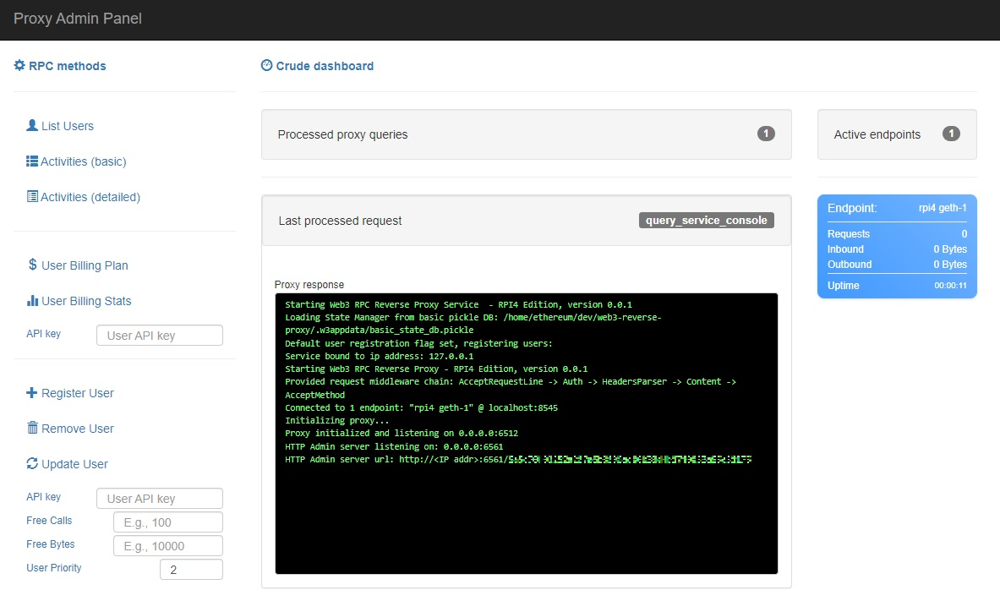

# Web3Pi Reverse Proxy

A reverse proxy for Geth intended for use within Web3Pi ecosystem.

Web3Pi Reverse Proxy comes out-of-the-box with several features:
 
 - Multiple geth nodes - you can hide multiple Geth nodes under single instance of reverse proxy
 - JSON-RPC parser - our custom parser validates JSON-RPC requests before they reach the nodes
 - Admin portal - comes embedded in, allowing you the following:
	- Authentication - generate API-keys and control access to your reverse proxy
	- User plans - control how much data users can process
	- Activity stats - see how much data each user processes, monitor node usage
	- Admin API - use JSON-RPC based API to perform various operations on your reverse proxy
 
## Setup

Simply install `web3pi-proxy` package using your Python package manager, using **pip** for example:

```bash
pip install web3pi-proxy
```

Web3Pi Reverse Proxy expects you to provide **ETH_ENDPOINTS** environment variable to your system.

It should be a list of endpoint descriptors for JSON-RPC over HTTP communication with Geth.

Refer to the following example:

```bash
export ETH_ENDPOINTS='[{"name": "rpi geth 1", "url": "http://eop-1.local:8545/"}, {"name": "infura", "url": "https://mainnet.infura.io/v3/<YOUR_INFURA_API_KEY>"}]'
```

You can define as many endpoints as you wish and chose their names however suits you.

## Run

After configuring endpoints, you can run your reverse proxy with command

```bash
web3pi-proxy
```

## Admin service

Admin service starts alongside the reverse proxy.


You can access admin webpage with your browser using admin server's URL and providing **admin auth token** as a 'token' query param, like so:

```
http://0.0.0.0:6561/?token=<ADMIN_AUTH_TOKEN>
```

### Reference Image




The **admin auth token** will be output to your terminal, during the launch.

Token is not stored and will be randomly generated on each launch.

Outside of admin portal, the admin service allows several operations, performed by submitting JSON-RPC requests.
Use **admin auth token** in **Authorization** header of your HTTP POST request for authentication.

### get_endpoints
Get list of currently configured endpoints, no parameters required.

### add_endpoint
Add new endpoint at runtime by providing its **name** and **URL**. For example, in order to add endpoint ***local*** under URL ***localhost:8545*** :

```
{"jsonrpc": "2.0", "method": "add_endpoint", "params": ["local", "http://localhost:8545/"], "id": 0}
```

**IMPORTANT:** Resulting changes are saved in local `.env` file for reuse.

### update_endpoint
Change existing endpoint's configuration at runtime by providing its **name** and **URL**. For example, in order to change endpoint's ***local*** port to ***8546*** :

```
{"jsonrpc": "2.0", "method": "update_endpoint", "params": ["local", "http://localhost:8546/"], "id": 0}
```

**IMPORTANT:** Resulting changes are saved in local `.env` file for reuse.

### remove_endpoint
Remove endpoint at runtime by providing its **name**. For example, in order to remove endpoint ***local*** :

```
{"jsonrpc": "2.0", "method": "update_endpoint", "params": ["local"], "id": 0}
```

**IMPORTANT:** Resulting changes are saved in local `.env` file for reuse.
