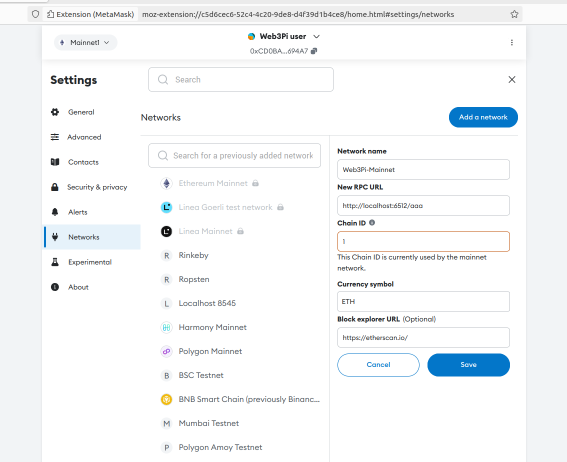

# RPC Reverse Proxy

A reverse proxy for Geth intended for use within Web3Pi ecosystem.

RPC Reverse Proxy comes out-of-the-box with several features:
 
 - Multiple geth nodes - you can hide multiple Geth nodes under single instance of reverse proxy
 - JSON-RPC parser - our custom parser validates JSON-RPC requests before they reach the nodes
 - Admin portal - comes embedded in, allowing you the following:
	- Authentication - generate API-keys and control access to your reverse proxy
	- User plans - control how much data users can process
	- Activity stats - see how much data each user processes, monitor node usage
	- Admin API - use JSON-RPC based API to perform various operations on your reverse proxy
 
## Setup

You can install `web3pi-proxy` in one of two ways:

### Install via PyPI

Simply install `web3pi-proxy` package using your Python package manager, using **pip** for example:

```bash
pip install web3pi-proxy
```

### Install from source

To install the package from source, follow these steps:

```bash
git clone https://github.com/Web3-Pi/web3-reverse-proxy.git
cd web3-reverse-proxy
python3 -m venv venv
source venv/bin/activate
pip install poetry
poetry install
```

## Configuration

You can define the following environment variables, and you can place them in the .env file (all are optional):

| Variable                        | Default                 | Description                                                                                                                                                                                                                                                                                      |
|---------------------------------|-------------------------|--------------------------------------------------------------------------------------------------------------------------------------------------------------------------------------------------------------------------------------------------------------------------------------------------|
| `LOG_LEVEL`                     | `INFO`                  | Specifies the logging level.                                                                                                                                                                                                                                                                     |
| `ADMIN_AUTH_TOKEN`              | Randomly generated      | Admin authentication token.                                                                                                                                                                                                                                                                      |
| `ETH_ENDPOINTS`                 | `None`                  | A JSON list of endpoint descriptors for Ethereum nodes. Example: `[{"name": "rpi4", "url": "http://localhost:8545/"}]`. If defined, this list becomes static and cannot be managed via the admin panel. Leaving it undefined enables endpoint management via the admin panel and local database. |
| `DEFAULT_RECV_BUF_SIZE`         | `8192`                  | Buffer size for socket receiving.                                                                                                                                                                                                                                                                |
| `PUBLIC_SERVICE`                | `False`                 | Whether the service is public.                                                                                                                                                                                                                                                                   |
| `USE_UPNP`                      | `True`                  | Enables UPnP if `PUBLIC_SERVICE` is `True`.                                                                                                                                                                                                                                                      |
| `UPNP_DISCOVERY_TIMEOUT`        | `2.5`                   | Timeout for UPnP discovery in seconds.                                                                                                                                                                                                                                                           |
| `UPNP_LEASE_TIME`               | `18000` (5 hours)       | Lease time for UPnP in seconds.                                                                                                                                                                                                                                                                  |
| `PROXY_LISTEN_ADDRESS`          | `0.0.0.0`               | Address for the proxy to listen on.                                                                                                                                                                                                                                                              |
| `PROXY_CONNECTION_ADDRESS`      | `None`                  | Address clients use to connect to the proxy. Default is `None` (auto-resolved).                                                                                                                                                                                                                  |
| `PROXY_LISTEN_PORT`             | `6512`                  | Port for the proxy to listen on.                                                                                                                                                                                                                                                                 |
| `NUM_PROXY_WORKERS`             | `150`                   | Number of workers handling proxy connections.                                                                                                                                                                                                                                                    |
| `MAX_PENDING_CLIENT_SOCKETS`    | `10000`                 | Maximum number of pending client sockets.                                                                                                                                                                                                                                                        |
| `MAX_CONCURRENT_CONNECTIONS`    | `21`                    | Maximum number of concurrent connections.                                                                                                                                                                                                                                                        |
| `IDLE_CONNECTION_TIMEOUT`       | `300`                   | Timeout for idle connections in seconds.                                                                                                                                                                                                                                                         |
| `SSL_ENABLED`                   | `False`                 | Whether SSL is enabled.                                                                                                                                                                                                                                                                          |
| `SSL_CERT_FILE`                 | `cert.pem`              | Path to SSL certificate file.                                                                                                                                                                                                                                                                    |
| `SSL_KEY_FILE`                  | `key.pem`               | Path to SSL key file.                                                                                                                                                                                                                                                                            |
| `CACHE_ENABLED`                 | `False`                 | Whether caching is enabled.                                                                                                                                                                                                                                                                      |
| `CACHE_EXPIRY_MS`               | `300000` (5 minutes)    | Cache expiry time in milliseconds.                                                                                                                                                                                                                                                               |
| `JSON_RPC_REQUEST_PARSER_ENABLED` | `True`                  | Enables JSON-RPC request parsing.                                                                                                                                                                                                                                                                |
| `STATS_UPDATE_DELTA`            | `12`                    | Update interval for stats in seconds.                                                                                                                                                                                                                                                            |
| `ADMIN_LISTEN_ADDRESS`          | `0.0.0.0`               | Address for the admin panel to listen on.                                                                                                                                                                                                                                                        |
| `ADMIN_CONNECTION_ADDRESS`      | `None`                  | Address clients use to connect to the admin panel. Default is `None` (auto-resolved).                                                                                                                                                                                                            |
| `ADMIN_LISTEN_PORT`             | `6561`                  | Port for the admin panel to listen on.                                                                                                                                                                                                                                                           |
| `DB_FILE`                       | `web3pi_proxy.sqlite3`  | Path to the database file.                                                                                                                                                                                                                                                                       |
| `MODE`                          | `PROD`                  | Proxy mode (`DEV`, `SIM`, `PROD`).                                                                                                                                                                                                                                                               |
| `LOADBALANCER`                  | `LeastBusyLoadBalancer` | Load balancer strategy (`RandomLoadBalancer`, `LeastBusyLoadBalancer`, `ConstantLoadBalancer`).                                                                                                                                                                                                  |
| `ENABLE_TRUSTED_NODE_VERIFICATION` | `False`                 | Enables or disables response verification through a trusted node. If set to `True`, all RPC responses will be validated against a trusted node before being forwarded. |
| `TRUSTED_NODE_URL`                 | `None`                  | Specifies the URL of the trusted Ethereum node used for response verification. This node acts as the reference point for validating RPC responses. |

## Run

You can run your reverse proxy with command:

```bash
web3pi-proxy
```

## Admin service

Admin service starts alongside the reverse proxy.


You can access admin webpage with your browser using admin server's URL and providing **admin auth token** as a 'token' query param, like so:

```
http://0.0.0.0:6561/?token=<ADMIN_AUTH_TOKEN>
```

### Reference Image


The **admin auth token** will be output to your terminal, during the launch.

Token is not stored and will be randomly generated on each launch, unless it has been defined as an environment variable or in the .env file.

Outside of admin portal, the admin service allows several operations, performed by submitting JSON-RPC requests.
Use **admin auth token** in **Authorization** header of your HTTP POST request for authentication.

### get_endpoints
Get list of currently configured endpoints, no parameters required.

### add_endpoint
Add new endpoint at runtime by providing its **name** and **URL**. For example, in order to add endpoint ***local*** under URL ***localhost:8545*** :

```
{"jsonrpc": "2.0", "method": "add_endpoint", "params": ["local", "http://localhost:8545/"], "id": 0}
```

**IMPORTANT:** Resulting changes are saved in local `.env` file for reuse.

### update_endpoint
Change existing endpoint's configuration at runtime by providing its **name** and **URL**. For example, in order to change endpoint's ***local*** port to ***8546*** :

```
{"jsonrpc": "2.0", "method": "update_endpoint", "params": ["local", "http://localhost:8546/"], "id": 0}
```

**IMPORTANT:** Resulting changes are saved in local `.env` file for reuse.

### remove_endpoint
Remove endpoint at runtime by providing its **name**. For example, in order to remove endpoint ***local*** :

```
{"jsonrpc": "2.0", "method": "remove_endpoint", "params": ["local"], "id": 0}
```

**IMPORTANT:** Resulting changes are saved in local `.env` file for reuse.

## Wallet integration

Any client can connet RPC Reverse Proxy. 
A web client, scripting tools, backend servers etc. 
It is the same as with other Ethereum RPC providers: you need to use a user's access URL containing API key.
The proxy supports CORS, which enables usage within web browsers.

Users may wish to integrate the proxy with wallet applications, e.g. Metamask.
Below is the example of a proper configuration.
It is convenient to create a duplicate of Mainnet network configuration.
The only specific piece of setup is the RPC URL, which needs to be set to the access URL (that contains proxy's RPC endpoint and user's API key).
See the example below.



In case of any problems with the verification of the newly added network, the best place to start the investigation is to check the network traffic,
for instance with the web browser's dev tools/developers tools (Ctrl+Shift+C).

